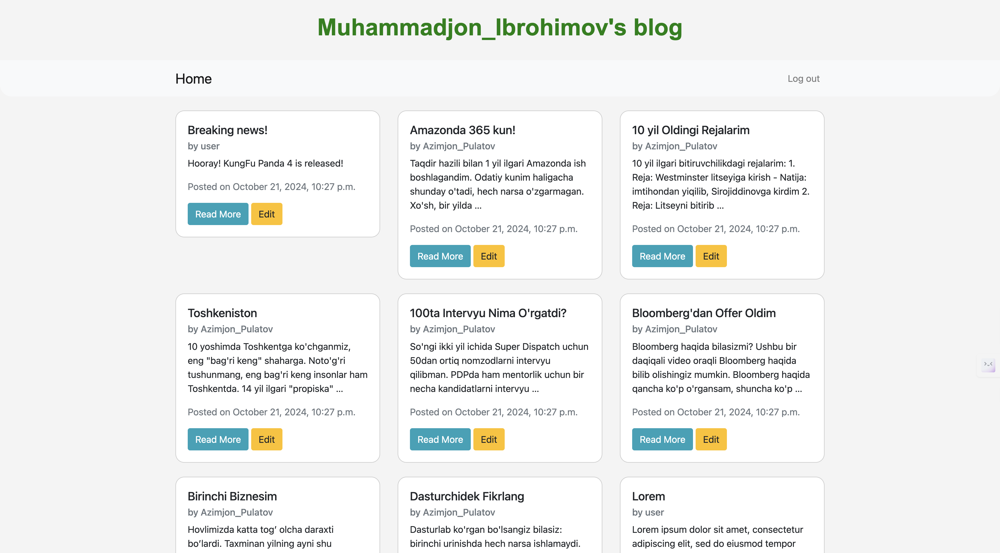
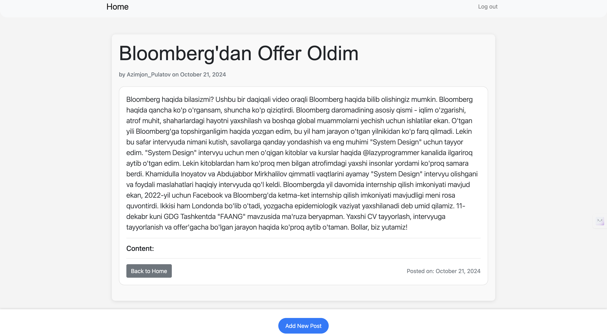
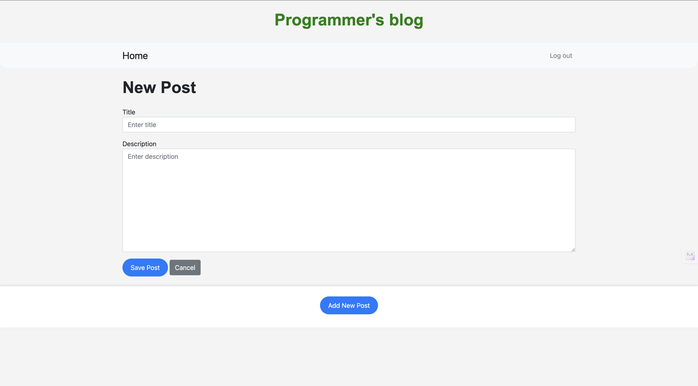
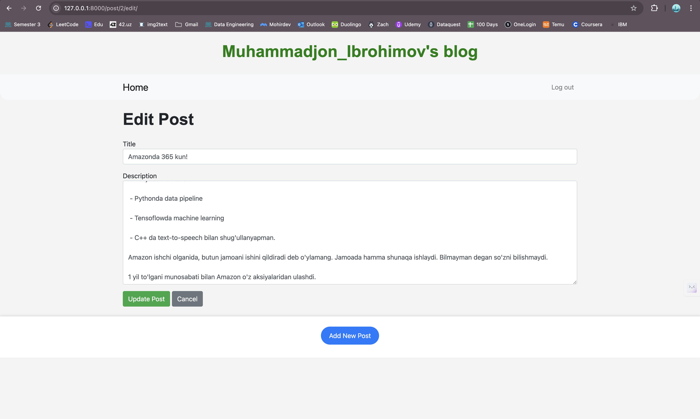

# {Your} Blog Project

A simple Django-based blog application where users can read, write, and manage blog posts. This project is designed with a clean and user-friendly interface, featuring user authentication and post management.

## Features

- **User Authentication**: Log in, Sign up, and Log out functionalities.
- **Post Management**: Users can view posts in a compact format, and clicking "Read More" directs them to the detailed post page.
- **Blog Management**: Users can add, edit, delete posts with a posted date in each posts to make their blogging accurate and moderate
- **Bootstrap Integration**: The UI is styled with Bootstrap to ensure modern design elements.
- **Custom Post Layout**: Posts are displayed in small, card-like sections with an attractive design. The detailed post view is optimized for readability.

## Tech Stack

- **Backend**: Django 5.0.3
- **Frontend**: HTML, CSS (Bootstrap), JavaScript (jQuery)
- **Database**: SQLite (default Django database)
- **Templates**: Django template system

## Installation

### Clone the Repository**:
   ```bash
   git clone https://github.com/yourusername/programmers-blog.git
   cd programmers-blog
### Create a Virtual Environment:

```bash
python3 -m venv .venv
source .venv/bin/activate  # For Linux/MacOS
.venv\Scripts\activate  # For Windows
```

### Install the Required Dependencies:

```bash
pip install -r requirements.txt
```

### Apply Migrations:

```bash
python manage.py migrate
```

```bash
python manage.py createsuperuser
```

### Run the Development Server:

```bash
python manage.py runserver
```
The app will be available at http://127.0.0.1:8000/.


# Preview Photos of the Website:
  
  
  
  
